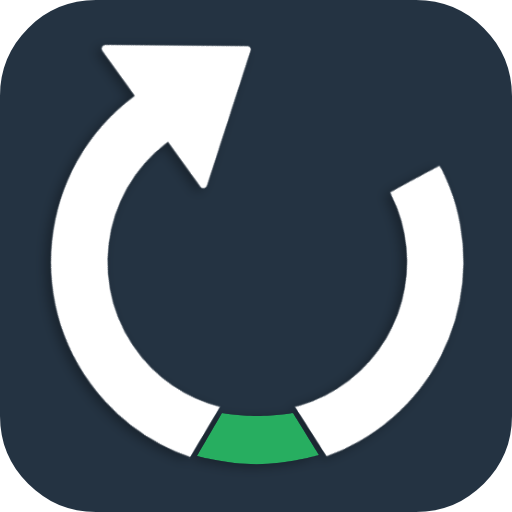

 
<h2 align="center"><b>Awb</b></h2>
<h4 align="center">A free and open-source Android app to quit digital addiction.</h4>

<a href="#screenshots">Screenshots</a> &bull; <a href="#description">Description</a> &bull; <a href="#features">Features</a> &bull; <a href="#installation">Installation</a> &bull; <a href="#contribution">Contribution</a> &bull; <a href="#license">License</a>

<a href="https://mohamed-sallam.github.io">Website</a>

*Read this in other languages: [العربية](../README.md), [English](README.en.md).*

> **Warning**
> 
>THIS IS A BETA VERSION, THEREFORE YOU MAY ENCOUNTER BUGS. IF YOU DO, OPEN AN ISSUE VIA OUR GITHUB REPOSITORY.

## Screenshots

## Description

 

Awb works with your self-control with the pre-commitment strategy; If the soul is like a baby, as Imam Al-Busairi -may God have mercy on him- said:
 
> The soul is like a baby, if you neglect him, he will grow in love with breastfeeding, and if you wean him, he will be weaned

Then one of the ways of weaning that baby is self-control by pre-commitment strategy, the most famous example of it is the story [Ulysses and the Sirens](https://en.wikipedia.org/wiki/Ulysses_and_the_Sirens_(Waterhouse)); Therefore, Awb contracts with you a contract of self-control for a period that you specify and applications you choose, and upon the expiration of that period, you can use all the applications installed on your phone Normally.

### Features

- Lockout the phone for some time (from 1s to ~25h).
- Use a **minimal launcher** that allows only useful apps during the detoxing period while locking other time-wasting apps.
- Impossible to break the lock even if you restart the phone :wink:.
- Lightweight, fast and minimal.
- Free (as in freedom) and Open Source app.
- NO Ads.
- NO ANY form of data collection. Check it out! It's open-source.
- FREE.

## Installation

Download the APK from [GitHub Releases](https://github.com/mohamed-sallam/awb-android/releases/) and install it.

There is no version available on Google Play Store or F-Droid yet.

> **Note**
> 
>Awb will ask you for two permissions when you first launch it, so you must allow them. It will also ask you for another permission every time you turn the lock on, so allow that too.

## Contribution

We welcome all contributions, whether ideas, translations, design changes, code cleaning or changing the code by adding, 
deleting or modifying, in the known ways to contribute on GitHub, whether by making a fork and then make pull request
or submitting an issue in the Issues section.

You can contact me by email below: 

muhd[dot]sallam[at]gmail[dot]com

## Privacy Policy

Awb does not collect any data about you in any way with or without your consent.

## License

Awb is Free Software: You can use, study, share, and improve. Specifically you can redistribute and/or modify it under the terms of the version 2 of 
[Mozilla Public License](https://www.mozilla.org/en-US/MPL/2.0/) as
published by Mozilla Foundation.
